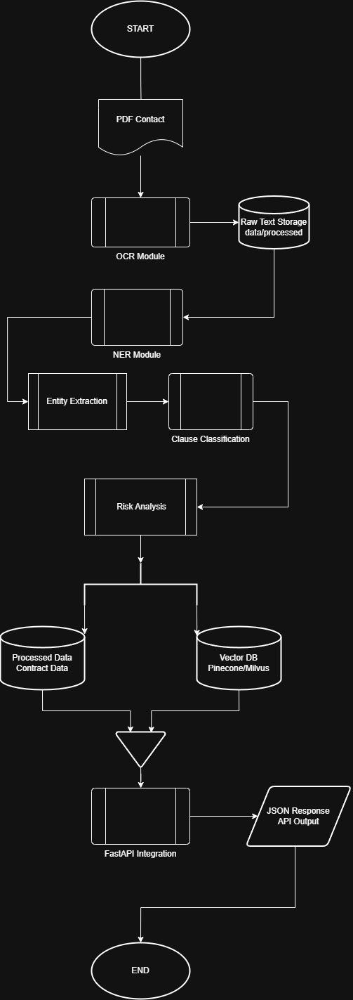

## 🏗️ Project Architecture & Workflow
The platform processes data through a highly decoupled, modular pipeline to maximize throughput, data integrity, and pipeline maintainability.

The following diagram illustrates the high-level workflow of the LexiGuard AI system.


### Module Interface & Target Specifications

| Module Component | Downstream Output Format | Data Schema Objective |
| :--- | :--- | :--- |
| **OCR Ingestion Engine** | `String: Raw Text` | Normalizes unstructured layout strings into unified arrays. |
| **NER Extraction Model** | `Dictionary: Legal Entities` | Extracts token offsets for locations, dates, titles, and parties. |
| **Clause Classifier** | `List[Dict]: Segmented Text` | Maps semantic blocks to legal domain targets (e.g., Indemnity). |
| **Risk Scoring Matrix** | `Float: Calculated Vector` | Returns bounded danger coefficients and deviation metrics. |
| **Vector Embedding Space**| `NDArray: High-D Embeddings` | Indexes multi-page semantic tensors for conceptual lookup. |
| **FastAPI Core Gateway** | `JSON System Output` | Returns verified HTTP payloads containing composite analyses. |

---

## 📂 Repository Structure
The project structure is highly modular, following industry best practices for enterprise ML applications:

```text
LexiGuard-AI/
├── data/
│   ├── raw/                  # Cached raw source PDFs/documents
│   └── processed/            # Cleaned, tokenized, and structured textual data
├── docs/                     # API documentation, architectures, and user manuals
├── notebooks/                # Jupyter Notebooks for EDA, model training, & prototyping
├── src/                      # Production source code
│   ├── api/                  # FastAPI routers, endpoints, and request/response schemas
│   ├── ocr/                  # Optical Character Recognition and parsing logic
│   ├── ner/                  # spaCy pipelines and inference for entity extraction
│   ├── clause_classifier/    # PyTorch/Hugging Face transformer inference scripts
│   ├── embeddings/           # Text chunking and vector database indexing modules
│   └── utils/                # Logging, configuration utilities, and decorators
├── tests/                    # Comprehensive unit, integration, and API tests
├── requirements.txt          # Application dependencies
├── Dockerfile                # Multi-stage production Docker configuration
├── README.md                 # Main project documentation
└── LICENSE                   # Open-source license file